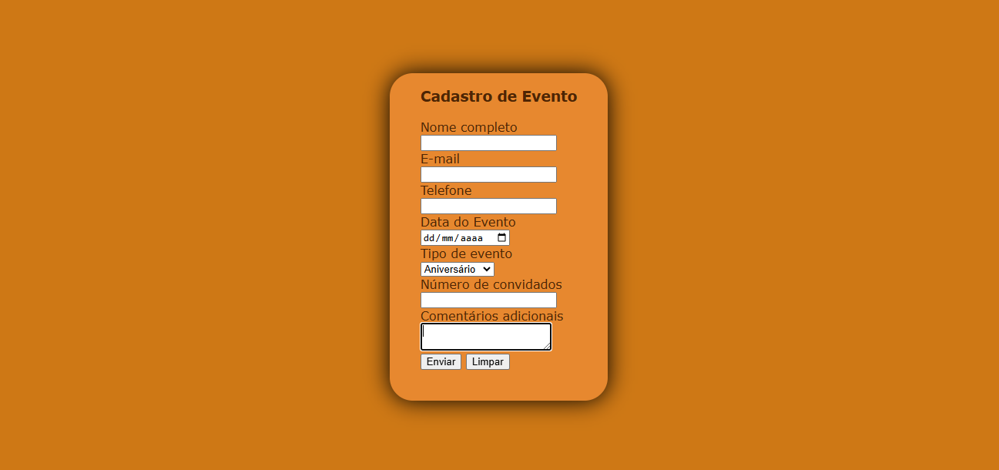
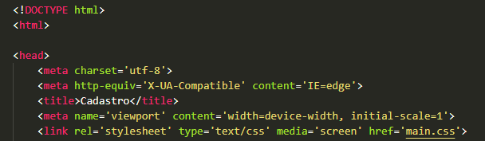
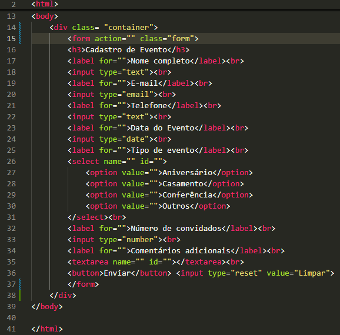

# Projeto - Formulário de Cadastro de Evento.

Projeto criado como parte da disciplina de Fundamentos de Desenvolvimento, ministrada pelo professor Leonardo Rocha.

## Índice

* [Descrição](#descrição)
* [Tecnologias](#tecnologias)
* [Referências](#referencias)
* [Autor(a)](#autora)
* [Estilização](#estilização)

### Descrição

O projeto consiste na composição de uma página de "Cadastro", para que o usuário insira informações necessáfrias para se agendar a criação de um evento. Para construção desse projeto, foram reutilizados os projetos de [Formulário de contato](https://github.com/gMariaC/form-contato), [Formulário de login](https://github.com/gMariaC/projeto-login).

# Resultado do projeto.



## Cadastro Evento.

* DOCTYPE - É uma instrução para o navegador da web que diz em qual versão do HTML a página é escrita.
* Main - Define o título do documento, mostrado na barra de título de um navegador ou na aba da página.
* Link - Especifica as relações entre o documento atual e um recurso externo.
* Meta - Define qualquer informação de metadados que não podem ser definidos por outros elementos HTML.
* title - Define o título do documento, mostrado na barra de título de um navegador ou na aba da página.

Veja a seguir uma imagem de parte do código, onde é possível identificar o uso dos elementos mencionados a cima:



* Head - Providencia informações gerais (metadados) sobre o documento, incluindo seu título e links para scripts e folhas de estilos.
* body - Serve para representar tudo o que é exibido na página.
* br - Cria uma quebra de linha em um texto.
* form - Serve para criar formulários e definir a forma como eles se comportam.
* label - Especifica o rótulo de um input em um formulário, e é importante para a experiência de um usuário.
* input - Serve para criar campos de entrada de dados interativos, que permitem o usuário insira textos, números, datas, cores, entre outros.
* select - Representa um controle que apresenta um menu de opções.
* option - Apresentam opções dentro do menu criado pelo elemento "select".
* button - Insere botões clicáveis em páginas e formulários, que podem executar ações quando um usuário clica neles.
* "type= "reset"" - Cria também um botão, com a função de limpar todas as informações que foram escritas na página.

A seguir, mais uma imagem de parte do código, onde se visualiza os elementos citados a cima:



## Estilização

O projeto foi estilizado, utilizando CSS3. Foi criado um arquivo chamado main.css. Neste arquivo, constam as seguintes configurações de estilo:

#### Estilo de cores na página.
* background-color - Define a cor de fundo de algo na página, e foi usado como se vê a seguir:
```
body{
    background-color: rgb(206, 120, 21);
}
```
* color - Define a cor das letras na página.
```
.form{
    color: rgb(77, 37, 4);
}
```

#### Altura e largura de um conteúdo.
* height - Determina a altura da área do conteúdo de um elemento.
```
.container{
    height: 100%;
}
```
* width - Determina a largura da área de conteúdo de um elemento.
```
.container{
    width: 100%;
}
```

#### Distância entre conteúdos.
* padding - Define uma a distância entre o conteúdo de um elemento e suas bordas.
```
.form{
    padding: 40px;
}
```
* padding-top - Define as dimensões do espaçamento interno superior (distância do elemento para sua própria borda.
```
.form{
    padding-top: 0;
}
```

#### Fonte principal da página:
```
body{
    font-family: Verdana;
}
```

#### Caixa para inserir textos.
* border-radius - Adiciona bordas arredondadas a caixa de textos.
```
.form{
    border-radius: 30px;
}
``` 
* box-shadow - Adiciona sombra a volta da caixa.
```
.form{
    box-shadow: 0 0 30px black;
}
```
* O background-color também foi utilizado na caixa de texto para definar a cor dela.
```
.form{
    background-color: rgb(231, 136, 47);
}
```

#### Organização.
* display - Uma propriedade utilizada para organizar os elementos na página HTML.
```
body{
    display: flex;
}
```

## Tecnologias

* HTML
* CSS3
* README
* Git
* GitHub

## Referencias

* [Alura](https://www.alura.com.br/artigos/escrever-bom-readme) - Como escrever um README íncrivel no seu GitHub.
* [Formulário de contato](https://github.com/gMariaC/form-contato)
* [Formulário de login](https://github.com/gMariaC/projeto-login)
* [Mmdn web docs](https://developer.mozilla.org/pt-BR/docs/Web/HTML/Element/select)
* [HTML progressivo](https://www.htmlprogressivo.net/)

## Autor(a)

Projeto desenvolvido pela aluna:
* Maria Clara da Silva Gonçalves